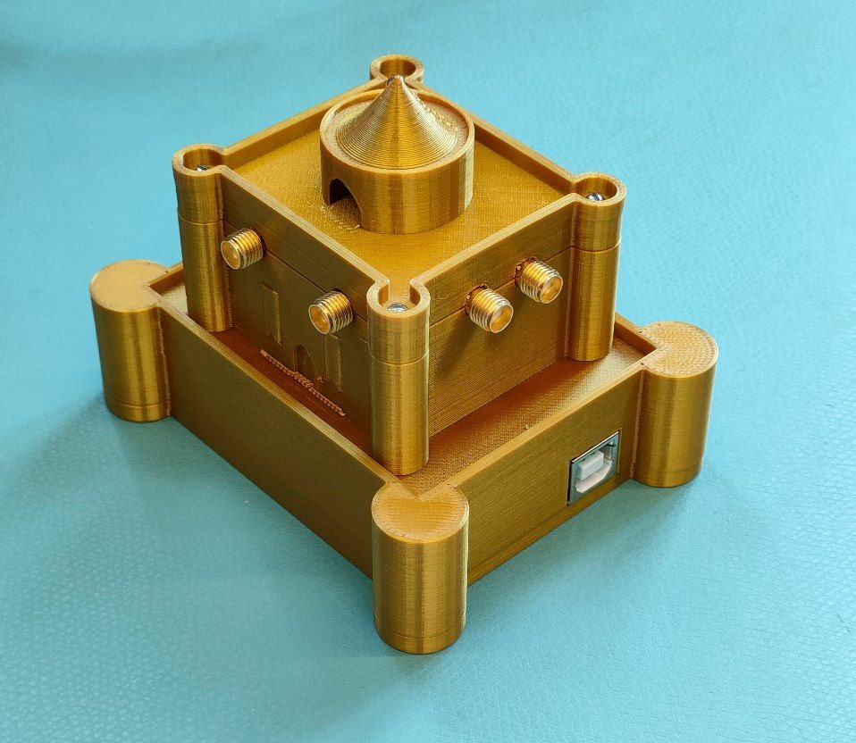

# The Castle RF multiplexer

A simple and easy interface to control *The Castle*, an RF multiplexer I made for the lab to automate the measurement of LGAD devices.



# Python interface

There is [a simple Python interface](code/python) to make it trivial to operate from the computer.

## Installation

```
pip install -e PATH_TO_THE_DIRECTORY_WHERE_THIS_README_FILE_IS/code/python
```

## Usage

```python
from The_Castle_RF_multiplexer import The_Castle

for cmd in {'IDN?','VERSION?','inexistent_command'}:
	print(cmd)
	print(The_Castle.query(cmd))

for k in [1,2,3,4,5,6,7,8]:
	print(f'Connecting channel {k}...')
	The_Castle.connect_channel(k)
```

# Arduino firmware

*The Castle* has an Arduino Uno board inside that implements a text based command interface through the serial port. The firmware is available [here](code/arduino).

# The magical component

The magic for the RF multiplexing is done by an [EV1HMC321ALP4E](https://www.analog.com/media/en/technical-documentation/data-sheets/hmc321a.pdf). This is hidden inside the tower of *The Castle*.


